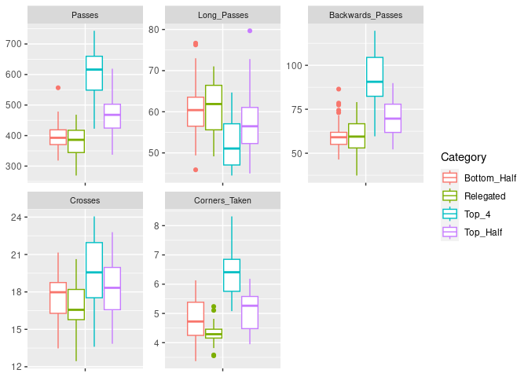
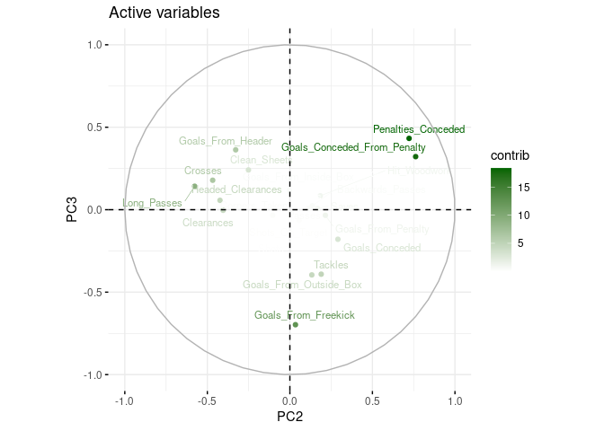
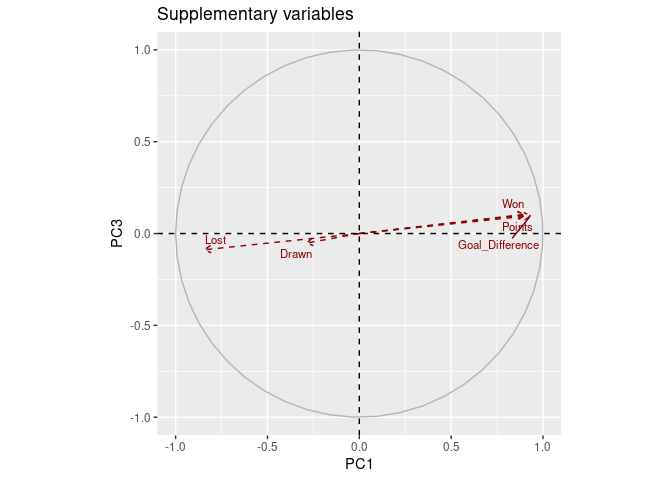

Principal Component Analysis of Premier League football data
================
Daniel Finnan  
<https://github.com/daniel-finnan/football_pca>

January 20, 2024

This is a [Principal Component
Analysis](https://en.wikipedia.org/wiki/Principal_component_analysis)
(PCA) intended to carry out an exploratory analysis of statistics from
the Premier League. It uses data from the past 6 seasons, as well as the
current unfinished 23/24 season. The goal (pun intended) is to discover
links between the variables and identify similarities between the
individuals. Data for the current season is dated 4 January, with all
but four teams having played 20 games.

The approach is based on data for a team in a given season, focused on
long-term performance, rather than on a match-by-match basis. It
includes variables from the league table, plus more detailed variables,
such as the number of times a team has hit the woodwork, or number of
own goals. In total, we have 38 quantitative variables covering 140
teams across 7 seasons, ideal for dimensionality reduction.

The data has been scraped from an online source using Python, with code
available in the [scraping folder](scraping/) of this repository.

This analysis is also available in [pdf format](README.pdf).

First, we’ll load the libraries we need.

``` r
library(FactoMineR)
library(factoextra)
library(ggplot2)
library(corrplot)
library(reshape2)
library(dplyr)
library(tibble)
library(rmarkdown)
library(car)

# Turn off scientific notation
options(scipen = 999)
```

## Data preparation

Read the data from the csv file we created during Python scraping and
create an index row.

``` r
data <- read.table("pl_data.csv",
                   header=TRUE, sep=";", dec=".")
rownames(data) <- data$Idx
```

### Adjust Everton

It is necessary to add back the 10 points deducted from Everton over
breaking financial rules. We also need to adjust the positions in the
table. This is important because the sanction has no direct impact on
the team’s performance statistics.

``` r
data["EVE2023_24", "Points"] <- 26
data["EVE2023_24", "Position"] <- 13

# Fulham, Crystal Palace, Nottingham Forest & Brentford need to drop a table position
data[c("FUL2023_24", "CRY2023_24", "NFO2023_24", "BRE2023_24"), "Position"] <- 
  data[c("FUL2023_24", "CRY2023_24", "NFO2023_24", "BRE2023_24"), "Position"] + 1
```

### Categories

Categorise the teams into *Top 4*, *Top Half*, *Bottom Half* and
*Relegated*, corresponding to qualification to the UEFA Champions
League, the bottom 3 relegated teams, and the rest split between the top
and bottom halves of the table.

``` r
data$Category <-  ifelse(data$Position >= 1 & data$Position <= 4, "Top_4",
                  ifelse(data$Position >= 5 & data$Position <= 10, "Top_Half",
                  ifelse(data$Position >= 11 & data$Position <= 17, "Bottom_Half", 
                  ifelse(data$Position >= 18 & data$Position <= 20, "Relegated", ""))))
```

### Subsets

#### Active and supplementary individuals

Teams from past seasons are our active individuals and the current
season contains our supplementary individuals.

``` r
data.active <- data[data$Season %in% c('2017_18', '2018_19', '2019_20', '2020_21',
                                       '2021_22', '2022_23'), ]
data.supp <- data[data$Season == '2023_24', ]
```

#### Variables

We group the variables according to their characteristics.

``` r
# List of all our variables
knitr::kable(colnames(data), caption = 'List of variables', col.names = c('Variable'))
```

| Variable                    |
|:----------------------------|
| Idx                         |
| Short_name                  |
| Position                    |
| Played                      |
| Won                         |
| Drawn                       |
| Lost                        |
| Goals_For                   |
| Goals_Conceded              |
| Goal_Difference             |
| Points                      |
| Yellow_Cards                |
| Red_Cards                   |
| Shots                       |
| Shots_On_Target             |
| Hit_Woodwork                |
| Goals_From_Header           |
| Goals_From_Penalty          |
| Goals_From_Freekick         |
| Goals_From_Inside_Box       |
| Goals_From_Outside_Box      |
| Goals_From_Counter_Attack   |
| Offsides                    |
| Clean_Sheets                |
| Saves                       |
| Blocks                      |
| Interceptions               |
| Tackles                     |
| Last_Man_Tackles            |
| Clearances                  |
| Headed_Clearances           |
| Own_Goals                   |
| Penalties_Conceded          |
| Goals_Conceded_From_Penalty |
| Passes                      |
| Through_Balls               |
| Long_Passes                 |
| Backwards_Passes            |
| Crosses                     |
| Corners_Taken               |
| Season                      |
| Category                    |

List of variables

``` r
# Split the variables into categories
general <- c(
  "Won",
  "Lost",
  "Goals_For",
  "Yellow_Cards",
  "Red_Cards")

attack <- c(
  "Shots",
  "Shots_On_Target",
  "Hit_Woodwork",
  "Goals_From_Header",
  "Goals_From_Penalty",
  "Goals_From_Freekick",
  "Goals_From_Inside_Box",
  "Goals_From_Outside_Box",
  "Goals_From_Counter_Attack",
  "Offsides")

defence <- c(
  "Clean_Sheets",
  "Goals_Conceded",
  "Saves",
  "Blocks",
  "Interceptions",
  "Tackles",
  "Last_Man_Tackles",
  "Clearances",
  "Headed_Clearances",
  "Own_Goals",
  "Penalties_Conceded",
  "Goals_Conceded_From_Penalty")

team_play <- c(
  "Passes",
  "Through_Balls",
  "Long_Passes",
  "Backwards_Passes",
  "Crosses",
  "Corners_Taken")

# Putting all the variables into one large vector
all_vars <- c(general, attack, defence, team_play)

# We're not interested in variables related to outcomes, i.e. Wins, Losses.
all_vars <- all_vars[! all_vars %in% c('Won', 'Lost')]

# Add the category variable we created
all_vars <- c(all_vars, 'Category')

# Create a vector for supplementary quantitative variables
supp_vars <- c('Won', 'Lost', 'Drawn', 'Points', 'Goal_Difference')

# Note: Goals For is not a sum of types of goals in attack category, so we'll leave it in.
```

### Analysis of variance

Given that our supplementary individuals are only part way through the
season we will compare the variance, grouping by season. We suspect that
some of our variables are low frequency occurrences, e.g. *Red Cards*,
that won’t have the same variance unless we have a sample of an entire
season. It is also possible that some of our variables aren’t normally
distributed. We therefore run both Levene’s test and Barlett’s test for
only the active individuals, i.e. the last six complete seasons, and
with the active and supplementary individuals, including the current,
unfinished season. Levene’s test is less sensitive to departures from
the normal distribution.

``` r
# Take out the Category variable
all_vars <- all_vars[! all_vars %in% c('Category')]
col_nums <- match(all_vars, names(data.active))

# First test for data without 2023/24 season
p_values_levene_active <- c()
p_values_barlett_active <- c()
for (i in col_nums) {
  var_test_levene_active <- leveneTest(data.active[,i] ~ data.active$Season)
  var_test_barlett_active <- bartlett.test(data.active[,i] ~ data.active$Season)
  p_values_levene_active <- c(p_values_levene_active, var_test_levene_active[1,3])
  p_values_barlett_active <- c(p_values_barlett_active, var_test_barlett_active$p.value)
}
# Next test for all data including 2023/24 season
p_values_levene_with_supp <- c()
p_values_barlett_with_supp <- c()
col_nums <- match(all_vars,names(data))
for (i in col_nums) {
  var_test_levene_with_supp <- leveneTest(data[,i] ~ data$Season)
  var_test_barlett_with_supp <- bartlett.test(data[,i] ~ data$Season)
  p_values_levene_with_supp <- 
    c(p_values_levene_with_supp, var_test_levene_with_supp[1,3])
  p_values_barlett_with_supp <- 
    c(p_values_barlett_with_supp, var_test_barlett_with_supp$p.value)
}

result_var <- data.frame(all_vars, p_values_levene_active, p_values_barlett_active, 
                         p_values_levene_with_supp, p_values_barlett_with_supp)
knitr::kable(
  result_var,
  col.names = c(
    'Variable',
    'p-value Levene\'s Test (active)',
    'p-value Barlett\'s Test (active)',
    'p-value Levene\'s Test (active & supp.)',
    'p-value Barlett\'s Test (active & supp.)'
    ),
  caption = "Equality of variance across seasons")
```

| Variable                    | p-value Levene’s Test (active) | p-value Barlett’s Test (active) | p-value Levene’s Test (active & supp.) | p-value Barlett’s Test (active & supp.) |
|:----------------------------|-------------------------------:|--------------------------------:|---------------------------------------:|----------------------------------------:|
| Goals_For                   |                      0.9955905 |                       0.9572639 |                              0.9986970 |                               0.9705449 |
| Yellow_Cards                |                      0.3399992 |                       0.1960549 |                              0.1191555 |                               0.0541656 |
| Red_Cards                   |                      0.7937712 |                       0.9059329 |                              0.0186474 |                               0.0467544 |
| Shots                       |                      0.8663386 |                       0.7538935 |                              0.9038174 |                               0.8433726 |
| Shots_On_Target             |                      0.9484813 |                       0.7461899 |                              0.9220180 |                               0.8014703 |
| Hit_Woodwork                |                      0.5447619 |                       0.6293745 |                              0.6489046 |                               0.6797470 |
| Goals_From_Header           |                      0.6517935 |                       0.6823331 |                              0.3264908 |                               0.4503763 |
| Goals_From_Penalty          |                      0.9758674 |                       0.9369802 |                              0.3419765 |                               0.4060741 |
| Goals_From_Freekick         |                      0.2868602 |                       0.1250603 |                              0.1595176 |                               0.1061669 |
| Goals_From_Inside_Box       |                      0.9764355 |                       0.9360190 |                              0.9898292 |                               0.9626992 |
| Goals_From_Outside_Box      |                      0.5121779 |                       0.4605865 |                              0.5236051 |                               0.5209465 |
| Goals_From_Counter_Attack   |                      0.7642042 |                       0.2929498 |                              0.8716523 |                               0.0443325 |
| Offsides                    |                      0.1235039 |                       0.1749159 |                              0.0626217 |                               0.0808906 |
| Clean_Sheets                |                      0.7791743 |                       0.4151258 |                              0.8636720 |                               0.5351277 |
| Goals_Conceded              |                      0.6605901 |                       0.4922396 |                              0.7765413 |                               0.6209010 |
| Saves                       |                      0.8810719 |                       0.9430708 |                              0.7781633 |                               0.8559776 |
| Blocks                      |                      0.9853524 |                       0.9882893 |                              0.9915402 |                               0.9904116 |
| Interceptions               |                      0.0145180 |                       0.0138629 |                              0.0286917 |                               0.0263362 |
| Tackles                     |                      0.5864739 |                       0.7007722 |                              0.6715628 |                               0.8088480 |
| Last_Man_Tackles            |                      0.4115447 |                       0.4686153 |                              0.0321501 |                               0.0929970 |
| Clearances                  |                      0.3846646 |                       0.3998411 |                              0.3716857 |                               0.4071761 |
| Headed_Clearances           |                      0.7080492 |                       0.4412628 |                              0.7669477 |                               0.5660520 |
| Own_Goals                   |                      0.0905144 |                       0.1994313 |                              0.1039059 |                               0.0839191 |
| Penalties_Conceded          |                      0.3615165 |                       0.4844947 |                              0.4338137 |                               0.4630899 |
| Goals_Conceded_From_Penalty |                      0.7131947 |                       0.4441343 |                              0.3440294 |                               0.1433620 |
| Passes                      |                      0.9955674 |                       0.9359083 |                              0.9960662 |                               0.9720742 |
| Through_Balls               |                      0.0175478 |                       0.0003351 |                              0.0360526 |                               0.0007602 |
| Long_Passes                 |                      0.7288465 |                       0.3971123 |                              0.5585881 |                               0.4027520 |
| Backwards_Passes            |                      0.9938562 |                       0.9853229 |                              0.9789966 |                               0.9547053 |
| Crosses                     |                      0.3884246 |                       0.2978525 |                              0.5234988 |                               0.4126462 |
| Corners_Taken               |                      0.7888063 |                       0.9109110 |                              0.8748960 |                               0.9292224 |

Equality of variance across seasons

There are several variables that have sufficient evidence at the 5%
level for different variances for both Barlett’s test and Levene’s test
when we compare the active versus active and supplementary individuals.
These include:

- *Red Cards*
- *Interceptions*
- *Through Balls*

Furthermore, the following variables at the 10% level for both tests:

- *Offsides*
- *Last Man Tackles*

And, these for just Barlett’s test at the 10% level:

- *Yellow Cards*
- *Goals From Counter Attack*
- *Own Goals*

This indicates that it is not valid to compare these variables between
active and supplementary individuals. We can confirm this with a visual
inspection.

``` r
# Reshape data for plots

# Only those variables with different variances plus Season
diff_vars <- c(
  "Red_Cards",
  "Interceptions",
  "Through_Balls",
  "Offsides",
  "Last_Man_Tackles",
  "Yellow_Cards",
  "Goals_From_Counter_Attack",
  "Own_Goals",
  "Season"
  )

data.diff_vars <- data[, diff_vars]

melt(data.diff_vars, id = "Season") %>%
  ggplot(., aes(x = variable, y = value, color = Season)) + 
    geom_boxplot() +
    facet_wrap(vars(variable), scales="free", nrow = 3, ncol = 3) +
    theme(
      strip.text = element_text(size = 8),
      axis.text.x=element_blank(),
      axis.title.x=element_blank(), 
      axis.title.y = element_blank())
```

<!-- -->

The boxplots show some evidence of more dispersion in the interquartile
range (IQR) for the incomplete 2023/24 season compared to prior seasons.
This is particularly pronounced for variables such as *Red Cards* and
*Last Man Tackles*. We also note much higher maximum values for *Goals
From Counter Attack*. It is clear that the reduced number of games we’re
looking at distorts these measures.

There are also a few variables which demonstrate unequal variance for
just the active individuals. This suggests there could be an inherent,
or a structural change in the variance over seasons. This impacts the
following variables:

For both tests at the 5% level

- *Interceptions*
- *Through Balls*

For Levene’s test at the 10% level

- *Own Goals*

Referring back to the boxplots, *Interceptions* appear to be decreasing
almost every season with the IQR moving lower and the median reducing.

For *Own Goals*, the boxplots appear to indicate a vague trend, with a
slight increase in the median and IQR. This variable is also another low
frequency measure. In the last full season Brighton and Hove Albion
scored the most own goals with 6 or 0.16 times per game. If we take the
full sample of 7 seasons, then 21 teams have never scored a single own
goal over the course of a season.

*Through Balls* is a bit more puzzling because we notice a big
difference for the 2020/21 season. This was the Covid-19 impacted season
with many games played behind closed doors. Liverpool registered the
highest number for the season with 44 and Crystal Palace the lowest with
8. If we compare that to the season before, Manchester City recorded 85
and Watford 12. Likewise for the season after, Liverpool made 112
through balls and West Ham United 29. We could question whether a lack
of fans at stadiums resulted in a change to the style of play. Although
there are also suggestions that through balls are becoming rarer across
European football in general, according to [The
Athletic](https://theathletic.com/3459692/2022/08/11/european-football-through-ball-dying-art/).
All the same, it is clear *Through Balls* in 2020/21 is an outlier.

Periodic changes to the Premier League rules could explain some of these
structural changes. Notably, Video Assistant Referee (VAR) was
introduced in the 2019/20 season, which ties into the downward trend for
*Interceptions*. But rule changes don’t immediately provide any
explanation for the different variances for the *Own Goals* or *Through
Balls* variables. We also note that Barlett’s test for *Own Goals*
doesn’t show sufficient evidence for a difference in variance when
considering only the active individuals.

We therefore exclude 8 variables from further inclusion in our analysis.
Some of these are obviously low frequency measures that are not
adequately captured for an incomplete season. Others demonstrate
structural changes in the variance over each season perhaps because of
rule changes, peculiarities such as Covid-19, or just the way in which
the game is played.

``` r
# Update our variables of interest, removing those we don't want
remove_vars <- c(
  "Red_Cards",
  "Interceptions",
  "Through_Balls",
  "Offsides",
  "Last_Man_Tackles",
  "Yellow_Cards",
  "Goals_From_Counter_Attack",
  "Own_Goals")
adj_vars <- all_vars[! all_vars %in% remove_vars]
```

## Descriptive statistics

Given the number of variables, we’ll examine the extremes of the active
individuals by looking at the 5 lowest and highest means and standard
deviations.

``` r
averages <- data.active[, adj_vars] %>% 
  apply(., 2, mean)
n_avgs <- length(averages)
sorted_avg_low <- sort(averages, decreasing = FALSE)
lowest_avg_5 <- sorted_avg_low[1:5]
sorted_avg_high <- sort(averages, decreasing = TRUE)
highest_avg_5 <- sorted_avg_high[1:5]

std_dev <- data.active[, adj_vars] %>%
  apply(., 2, sd)
n_std_dev <- length(averages)
sorted_std_dev_low <- sort(std_dev, decreasing = FALSE)
lowest_std_dev_5 <- sorted_std_dev_low[1:5]
sorted_std_dev_high <- sort(std_dev, decreasing = TRUE)
highest_std_dev_5 <- sorted_std_dev_high[1:5]

knitr::kable(lowest_avg_5, 
             col.names = c('Variable','Mean'), 
             caption = "5 lowest means")
```

| Variable                    |      Mean |
|:----------------------------|----------:|
| Goals_From_Freekick         | 0.0258772 |
| Goals_From_Penalty          | 0.1035088 |
| Goals_Conceded_From_Penalty | 0.1035088 |
| Penalties_Conceded          | 0.1407895 |
| Goals_From_Outside_Box      | 0.1822368 |

5 lowest means

``` r
knitr::kable(lowest_std_dev_5, 
             col.names = c('Variable','SD'), 
             caption = "5 lowest standard deviations")
```

| Variable                    |        SD |
|:----------------------------|----------:|
| Goals_From_Freekick         | 0.0270751 |
| Goals_Conceded_From_Penalty | 0.0586689 |
| Goals_From_Penalty          | 0.0621373 |
| Penalties_Conceded          | 0.0664737 |
| Goals_From_Header           | 0.0973791 |

5 lowest standard deviations

*Goals From Freekick*, *Goals From Penalty*, *Goals Conceded From
Penalty* and *Penalties Conceded* have the lowest means and the least
variability. These are rarer actions in a game, that happen more
infrequently and vary little according to the team. These are also all
actions resulting from intervention in games by the referee.

``` r
knitr::kable(highest_avg_5, 
             col.names = c('Variable','Mean'), 
             caption = "5 highest means")
```

| Variable         |      Mean |
|:-----------------|----------:|
| Passes           | 458.08553 |
| Backwards_Passes |  69.86096 |
| Long_Passes      |  58.36842 |
| Clearances       |  20.49978 |
| Crosses          |  18.08531 |

5 highest means

``` r
knitr::kable(highest_std_dev_5, 
             col.names = c('Variable','SD'), 
             caption = "5 highest standard deviations")
```

| Variable         |       SD |
|:-----------------|---------:|
| Passes           | 99.77413 |
| Backwards_Passes | 16.22843 |
| Long_Passes      |  7.69768 |
| Clearances       |  4.50207 |
| Crosses          |  2.41891 |

5 highest standard deviations

*Passes*, *Backwards Passes*, *Long Passes*, *Clearances* and *Crosses*
have the highest means and most variability. These are commonly
occurring actions in a game but can vary significantly according to the
team. These are all elements of team play, except *Clearances* which is
a defensive characteristic.

### Boxplots

We can further analyse the spread of the variables according to category
using boxplots.

``` r
# Update our variables of interest, removing those we don't want, adding category
general_adj <- c(general[! general %in% remove_vars], 'Category')
attack_adj <- c(attack[! attack %in% remove_vars], 'Category')
defence_adj <- c(defence[! defence %in% remove_vars], 'Category')
team_play_adj <- c(team_play[! team_play %in% remove_vars], 'Category')

# Function for making boxplots
create_boxplot <- function(arg_category, arg_nrow, arg_ncol) {
  melt(data.active[, arg_category], id = "Category") %>%
    ggplot(., aes(x = variable, y = value, color = Category)) + 
      geom_boxplot() +
      facet_wrap(vars(variable), scales="free", nrow = arg_nrow, ncol = arg_ncol) +
      theme(
        strip.text = element_text(size = 8),
        axis.text.x=element_blank(),
        axis.title.x=element_blank(), 
        axis.title.y = element_blank())
}
create_boxplot(general_adj, 1, 3)
```

<!-- -->

No surprise for the general variables. The boxplots are as expected
across the categories.

``` r
create_boxplot(attack_adj, 2, 4)
```

<!-- -->

For attack, the variables also have medians and IQR dispersion that you
would expect across the different categories. Although for *Hit
Woodwork*, *Goals From Penalty* and *Goals From Freekick* some of the
categories show similar medians and IQR. This somewhat fits in to our
calculations for the means and standard deviations, with these variables
being infrequent events in a game, therefore less representative across
the different categories.

``` r
create_boxplot(defence_adj, 3, 3)
```

<!-- -->

It is interesting with the defensive variables that the median for
*Saves* is very similar for *Bottom Half* and *Top Half* teams, although
dispersion of the IQR is a little greater for *Top Half* teams. It is
also the case for *Blocks*, which again shows similarity between *Top
Half* and *Bottom Half* teams. The *Tackles* variable demonstrates very
similar medians and IQRs for both *Top Half*, *Bottom Half* and
*Relegated teams*. The *Penalties Conceded* and *Goals Conceded From
Penalty* breaks from the norm across the categories, with *Top Half* and
*Relegated* teams closer in the median and IQR.

``` r
create_boxplot(team_play_adj, 2, 3)
```

<!-- -->

Looking at the team play category, the *Passes* variable demonstrates
the least dispersion in the IQR for *Bottom Half* teams, with
*Relegated* teams having a lower median, but more dispersion. *Long
Passes* has the highest median values for the *Relegated* category,
followed by *Bottom Half* teams, perhaps demonstrating a ‘hit and hope’
tactic for struggling clubs. *Backwards Passes* has the highest medians
for *Top 4* and *Top Half* clubs, probably stemming from the use of back
passes by the best performing teams to retain possession. *Crosses* and
*Corners Taken* appear quite predictable across the categories, although
we see that the IQR dispersion is very small for relegated teams in
*Corners Taken*, illustrating how difficult it is for this category of
team to force play into the final third of the field and be awarded a
corner.

### Correlation matrix

The sheer number of variables makes analysing correlations difficult
hence the use of PCA. Nevertheless, we can try to identify particularly
pertinent correlations between the variables.

``` r
cor.mat.all <- cor(data.active[, adj_vars])
corrplot(cor.mat.all, type="upper", order="hclust", method = 'circle',
         tl.col="black", tl.srt=45, tl.cex=0.75, number.cex=0.75)
```

<!-- -->

The attacking variables tend to be negatively correlated with defensive
variables. For instance, as a team has an increasing value for *Shots*
it has a decreasing number of *Saves* or *Blocks*. *Goals From Freekick*
are not strongly correlated with any other variable, maybe because these
are more of a freak occurence and might go against the run of play.

Within the defensive variables, *Tackles* don’t have a particularly
strong correlation with any other variables, but they do appear to
follow the same trend. For example, *Tackles* are negatively correlated
with *Goals For*. So, if you are tackling more, you are scoring less
goals since you are more likely to be on the back foot. And there is a
positive correlation with *Goals Conceded*, suggesting that even though
you are tackling more, this is not successful in defending against goals
from your opponents.

The team play attributes align themselves either with attacking or
defensive variables. *Passes* are positively correlated with attacking
variables and negatively with defensive ones. *Long Passes* are
negatively correlated with attacking variables like *Goals For* or
*Shots*, backing up the theory that this is part of a ‘hit and hope’
tactic for struggling clubs. *Backwards Passes* also support the
suggestion that this is part of a strategy used by stronger attacking
teams for maintaining possession, with a positive correlation to
attacking variables. *Crosses* have a positive correlation with *Corners
Taken*, which makes sense given that the ball will often be played short
to another player who then crosses it. Or, a team is attacking a lot
down the wing with the aim of providing crosses, and therefore forcing
lots of corners. *Corners Taken* are also more strongly correlated,
positively to attacking, and negatively to defensive variables than
*Crosses*. This again supports the hypothesis that weaker attacking
teams find it harder to force corners, with stronger teams winning more
corners because of their dominance around their opponents 18-yard box.

## PCA

Time to run the PCA, initially with same number of components as
variables.

``` r
# Number of variables
p <- length(adj_vars)
active_vars <- c(adj_vars, 'Category')
result.pca <- PCA(data.active[, active_vars], scale.unit = TRUE, ncp = p, graph = FALSE, 
                  quali.sup = 'Category')
eigenvalues <- result.pca$eig
knitr::kable(eigenvalues, caption = "Eigenvalues")
```

|         | eigenvalue | percentage of variance | cumulative percentage of variance |
|:--------|-----------:|-----------------------:|----------------------------------:|
| comp 1  | 11.5850313 |             50.3697011 |                          50.36970 |
| comp 2  |  2.4608282 |             10.6992531 |                          61.06895 |
| comp 3  |  1.3966885 |              6.0725586 |                          67.14151 |
| comp 4  |  1.0779401 |              4.6866963 |                          71.82821 |
| comp 5  |  1.0603971 |              4.6104222 |                          76.43863 |
| comp 6  |  0.8861750 |              3.8529347 |                          80.29157 |
| comp 7  |  0.7479887 |              3.2521248 |                          83.54369 |
| comp 8  |  0.6655176 |              2.8935548 |                          86.43725 |
| comp 9  |  0.5842241 |              2.5401048 |                          88.97735 |
| comp 10 |  0.5001868 |              2.1747250 |                          91.15208 |
| comp 11 |  0.4386702 |              1.9072619 |                          93.05934 |
| comp 12 |  0.3263722 |              1.4190095 |                          94.47835 |
| comp 13 |  0.2724804 |              1.1846972 |                          95.66304 |
| comp 14 |  0.2506092 |              1.0896054 |                          96.75265 |
| comp 15 |  0.2160610 |              0.9393956 |                          97.69204 |
| comp 16 |  0.1607242 |              0.6988009 |                          98.39085 |
| comp 17 |  0.1126559 |              0.4898083 |                          98.88065 |
| comp 18 |  0.1007790 |              0.4381695 |                          99.31882 |
| comp 19 |  0.0794713 |              0.3455273 |                          99.66435 |
| comp 20 |  0.0323461 |              0.1406352 |                          99.80499 |
| comp 21 |  0.0275157 |              0.1196336 |                          99.92462 |
| comp 22 |  0.0170096 |              0.0739550 |                          99.99857 |
| comp 23 |  0.0003278 |              0.0014251 |                         100.00000 |

Eigenvalues

``` r
# Scree plot
# Make the matrix play with ggplot
df <- data.frame(component=1:nrow(eigenvalues), eigenvalues=eigenvalues[, 1], 
                 variance=eigenvalues[, 2])
# Eigenvalues
ggplot(data = df, aes(x=component, y=eigenvalues)) + 
  geom_line(color="steelblue") +
  geom_point(color="steelblue") +
  labs(title="Scree Plot",x="Principal Component", y = "Eigenvalue") +
  scale_x_continuous(breaks=df$component)
```

<!-- -->

``` r
# Variance
ggplot(data = df, aes(x=component)) +
  geom_line(aes(y = variance), color="steelblue") +
  geom_point(aes(y = variance), color="steelblue") +
  labs(title="Variance Explained",x="Principal Component", y = "Variance") +
  scale_x_continuous(breaks=df$component) +
  scale_y_continuous(labels = scales::percent_format(scale = 1)) + 
  expand_limits(y = 50)
```

<!-- -->

### Number of components

We must decide on the number of principal components, $m$, to retain.
There’s lots written on this part of the PCA methodology, so we’ll refer
to an authority on the subject.

“It is crucial to know how small $m$ can be taken without serious
information loss,” according to I.T. Jolliffe, [Principal Component
Analysis](https://link.springer.com/book/10.1007/978-1-4757-1904-8).
There are various rules or guidelines.

If we follow Kaiser’s rule, we keep principal components with an
eigenvalue \> 1, therefore 5 components.

Cattel’s criteria looks for the “elbow” in the scree plot, “the point
beyond which the scree graph defines a more-or-less straight line,” says
Jolliffe. In our case, this would signal the use of 2 principal
components. Although Jolliffe is somewhat critical of this method, owing
to the degree of subjectivity.

Jolliffe also discusses choosing a cutoff in terms of the cumulative
percentage of total variance, suggesting a value between 70% and 90%. If
we use a 70% cutoff, we are driven towards 4 principal components,
providing a cumulative variance of 71%. The upper bounds, a 90% cutoff,
leads to 10 principal components, with a cumulative variance of 91%.

Given that we don’t have a consensus with these different criteria, we
choose 3 principal components since it provides a middle ground between
Cattel’s criteria and Jolliffe’s lower bound cutoff.

### Interpretation of the principal components

``` r
# Number of components
p <- 3
# Re-run PCA
result.pca <- PCA(data.active[, active_vars], scale.unit = TRUE, ncp = p, graph = FALSE, 
                  quali.sup = 'Category')
# Store the values so we can construct individual dataframes
coord <- result.pca$var$coord
cos2 <- result.pca$var$cos2
contrib <- result.pca$var$contrib
# This is our cutoff of interest, number of variables (minus 1 for Category)
num_vars <- length(adj_vars) - 1
contrib_cutoff <- 100/num_vars
```

We only interpret the variables that play a significant role
contributing to the component and use a simple framework for verbally
describing the strength of correlations.[^1]

| Value     | Description |
|-----------|-------------|
| 0.00-0.19 | Very weak   |
| 0.20-0.39 | Weak        |
| 0.40-0.59 | Moderate    |
| 0.60-0.79 | Strong      |
| 0.80-1.0  | Very strong |

Note: We’re using the excellent `FactoMineR` package by Sebastien Le,
Julie Josse and Francois Husson, which labels the principal components
as `Dim.1`, `Dim.2`, etc. To avoid confusion we’ll use the nomenclature
*PC1*, *PC2,* etc in discussion.

#### PC1

``` r
dim1 <- data.frame(coord[, 'Dim.1'], cos2[, 'Dim.1'], contrib[, 'Dim.1'])
names(dim1) <- c('coord', 'cos2', 'contrib')
dim1_cutoff <- subset(dim1, contrib > contrib_cutoff)
dim1_cutoff <- dim1_cutoff[order(dim1_cutoff$coord, decreasing = TRUE), ]
knitr::kable(dim1_cutoff)
```

|                       |      coord |      cos2 |  contrib |
|:----------------------|-----------:|----------:|---------:|
| Shots_On_Target       |  0.9338941 | 0.8721582 | 7.528319 |
| Shots                 |  0.9313257 | 0.8673676 | 7.486968 |
| Goals_For             |  0.9191252 | 0.8447911 | 7.292092 |
| Passes                |  0.9117317 | 0.8312547 | 7.175248 |
| Goals_From_Inside_Box |  0.9047963 | 0.8186564 | 7.066502 |
| Corners_Taken         |  0.8853995 | 0.7839322 | 6.766768 |
| Backwards_Passes      |  0.8730367 | 0.7621931 | 6.579120 |
| Clean_Sheets          |  0.7970204 | 0.6352415 | 5.483295 |
| Saves                 | -0.7410877 | 0.5492110 | 4.740695 |
| Clearances            | -0.7548651 | 0.5698213 | 4.918599 |
| Blocks                | -0.7804774 | 0.6091450 | 5.258035 |
| Goals_Conceded        | -0.7824303 | 0.6121971 | 5.284380 |

Several of the variables are very strongly correlated with *PC1*. *Shots
On Target*, *Shots*, *Goals For*, *Passes*, and *Goals From Inside Box*
all have a positive correlation \> 0.9 and high quality representation,
according to the $cos^2$ value. Notably, almost all of these variables
represent the outcome of an attempt on goal, with the exception of
*Passes*, although this variable is positively correlated to attacking
characteristics.

Next, we have *Corners Taken* and *Backwards Passes*, which are also
very strongly correlated and are all variables relating to team play.
These have a correlation \> 0.87 and high values for $cos^2$. *Clean
Sheets* have a strong positive correlation and is the first variable of
note related to defence. We recall that *Clean Sheets* are positively
correlated to our attacking variables.

For negative correlations, these are slightly weaker, but nevertheless
still strongly correlated for *Saves*, *Clearances*, *Blocks* and *Goals
Conceded*. The quality of representation is lower than the top
positively correlated variables.

Overall, this component contains important information relating to a
number of different characteristics spanning both attack, defence and
team play. If we put aside the team play variables, the attacking
variables are all focused on attempts on goal, while the defensive
variables are all about action resulting from a dangerous attack. We can
interpret this component as providing a measure of attack versus
defence. We’ll dub this component *attack-defence balance*.

#### PC2

``` r
dim2 <- data.frame(coord[, 'Dim.2'], cos2[, 'Dim.2'], contrib[, 'Dim.2'])
names(dim2) <- c('coord', 'cos2', 'contrib')
dim2_cutoff <- subset(dim2, contrib > contrib_cutoff)
dim2_cutoff <- dim2_cutoff[order(dim2_cutoff$coord, decreasing = TRUE), ]
knitr::kable(dim2_cutoff)
```

|                             |      coord |      cos2 |   contrib |
|:----------------------------|-----------:|----------:|----------:|
| Goals_Conceded_From_Penalty |  0.7618897 | 0.5804760 | 23.588643 |
| Penalties_Conceded          |  0.7221273 | 0.5214678 | 21.190745 |
| Clearances                  | -0.4042695 | 0.1634339 |  6.641417 |
| Headed_Clearances           | -0.4234157 | 0.1792809 |  7.285387 |
| Crosses                     | -0.4676450 | 0.2186919 |  8.886922 |
| Long_Passes                 | -0.5768155 | 0.3327161 | 13.520493 |

*Goals Conceded From Penalty* and *Penalties Conceded* are strongly
positively correlated to *PC2.* The quality of representation is
somewhat middling.

The next four most important variables for the component are
*Clearances*, *Headed Clearances*, *Crosses* and *Long Passes*, which
are all moderately negatively correlated. They are split between
defensive and team play characteristics. The quality of representation
here is all on the bottom end of the scale.

Recalling our descriptive statistics, the variables related to penalties
have some of the lowest means and dispersion, while *Long Passes*,
*Clearances* and *Crosses* have the highest means and most variability.
While if we go back to our boxplots from earlier, the *Top 4* tend to
have a higher value for *Crosses* and *Relegated* the most number of
*Long Passes*.

The first two variables obviously relate to the result of disciplinary
action in the box, and the last four could be all seen as variables
relating to aerial action (in the sense that the ball is likely to be in
air). We could conclude, given the positive and negative correlation to
the component, that this all relates to foul play. For instance, a
clearance or a cross that results in a foul in the box and leads to a
penalty. But unfortunately the variables that might most help us here
with interpretation, Red Cards and Yellow Cards, have been removed from
the analysis. So we’ll go with a bit a more generic label: *Misconduct*.

#### PC3

``` r
dim3 <- data.frame(coord[, 'Dim.3'], cos2[, 'Dim.3'], contrib[, 'Dim.3'])
names(dim3) <- c('coord', 'cos2', 'contrib')
dim3_cutoff <- subset(dim3, contrib > contrib_cutoff)
dim3_cutoff <- dim3_cutoff[order(dim3_cutoff$coord, decreasing = TRUE), ]
knitr::kable(dim3_cutoff)
```

|                             |      coord |      cos2 |   contrib |
|:----------------------------|-----------:|----------:|----------:|
| Penalties_Conceded          |  0.4323933 | 0.1869639 | 13.386230 |
| Goals_From_Header           |  0.3630486 | 0.1318043 |  9.436913 |
| Goals_Conceded_From_Penalty |  0.3218543 | 0.1035902 |  7.416842 |
| Tackles                     | -0.3910431 | 0.1529147 | 10.948377 |
| Goals_From_Outside_Box      | -0.3953946 | 0.1563369 | 11.193396 |
| Goals_From_Freekick         | -0.6973508 | 0.4862982 | 34.817940 |

The first three variables are weak to moderately positively correlated
to *PC3*. *Penalties Conceded* and *Goals Conceded From Penalty* are
defensive attributes, while *Goals From Header* is an attacking
variable. They have a poorer quality representation.

The next three: *Tackles*, *Goals From Outside Box* and *Goals From
Freekick*, are a mixture of defensive and attacking variables. *Tackles*
and *Goals From Outside Box* are weakly negatively correlated, while
*Goals From Freekick* is strongly negatively correlated. The quality of
representation is poor, except for *Goals From Freekick* which is
moderate.

All of these variables have very low means and little dispersion, except
for *Tackles*. The two most important variables here are *Goals From
Freekick* and *Penalties Conceded*, which are both the result of some
kind of refereeing decision. But with the others it is difficult to form
a clear interpretation of what this component represents. We’ve got both
goals resulting from a refereeing decision and those in free play, plus
we’ve got attacking and defensive characteristics. Together there is no
coherent explanation for *PC3*, therefore we deem this one not
interpretable.

#### Graphical representation

``` r
# Vector with indexes of supplementary individuals
supp_idx <- which(rownames(data) == data.supp$Idx)

# Vector with active and supplementary variables
pca_all_vars <- c(active_vars, supp_vars)

# Rerun PCA (including supplementary individuals and supplementary quantitative variables)
result.pca <- PCA(data[, pca_all_vars], scale.unit = TRUE, ncp = p, graph = FALSE, 
                  quanti.sup = supp_vars, quali.sup = 'Category', ind.sup = supp_idx)
```

The `factoextra` package by Alboukadel Kassambara and Fabian Mundt has
some really nice functionality for customising visualisations. We can
begin by projecting the active variables onto the principal components.

``` r
fviz_pca_var(result.pca, axes = c(1,2), repel = TRUE, labelsize = 3, 
             geom = c("point", "text"), col.var="contrib", invisible = "quanti.sup") +
  scale_color_gradient2(low="grey", high="blue") +
  labs(title ="Active variables", x = "PC1", y = "PC2")
```

<!-- -->

``` r
fviz_pca_var(result.pca, axes = c(1,3), repel = TRUE, labelsize = 3, 
             geom = c("point", "text"), col.var="contrib", invisible = "quanti.sup") +
  scale_color_gradient2(low="grey", high="darkred") +
  labs(title ="Active variables", x = "PC1", y = "PC3")
```

<!-- -->

``` r
fviz_pca_var(result.pca, axes = c(2,3), repel = TRUE, labelsize = 3, 
             geom = c("point", "text"), col.var="contrib", invisible = "quanti.sup") +
  scale_color_gradient2(low="grey", high="darkgreen") +
  labs(title ="Active variables", x = "PC2", y = "PC3")
```

<!-- -->

We can see a visual representation of our variables on the various PCs.
For example, *Shots*, *Shots On Target* and *Goals For* are all well
represented on the positive part of *PC1*, contrasted with *Blocks*,
*Saves* and *Goals Conceded* which are also well represented and reside
in the negative area. The lighter shaded variables are less well
represented, corresponding with a contribution that fell below the
threshold when we interpreted the PCs. We see that few variables are
well represented on *PC3*.

#### Active individuals

Next, we can project the teams from past seasons onto the PCs.

``` r
fviz_pca_ind(result.pca,
             axes = c(1, 2),
             label = 'none',
             habillage = 'Category',
             addEllipses = TRUE,
             invisible = "ind.sup"
             ) +
  labs(title ="Active individuals", x = "PC1", y = "PC2")
```

<!-- -->

The first graph demonstrates that the different categories of team
indeed occupy different areas on the PCs, but this only appears relevant
for the category in terms of *PC1*. *Top 4* teams reside in both the
positive and negative range of *PC2*. The same goes for *Top Half*,
*Bottom Half* and *Relegated* teams. The distribution for these
categories across *PC2* appears somewhat equal. And for *PC1* the
clustering of different categories has some overlap, which we see with
the concentration ellipses. This overlap appears more significant for
the *Top Half*, *Bottom Half* and *Relegated* teams.

``` r
fviz_pca_ind(result.pca,
             axes = c(1, 3),
             label = 'none',
             habillage = 'Category',
             addEllipses = TRUE,
             invisible = "ind.sup"
             ) +
  labs(title ="Active individuals", x = "PC1", y = "PC3")
```

<!-- -->

The second graph showing *PC1* and *PC3* again appears to indicate that
*PC1* is relevant to the categories, but not *PC3*.

``` r
fviz_pca_ind(result.pca,
             axes = c(2, 3),
             label = 'none',
             habillage = 'Category',
             addEllipses = TRUE,
             invisible = "ind.sup"
             ) +
  labs(title ="Active individuals", x = "PC2", y = "PC3")
```

<!-- -->

Finally, with the third graph of *PC2* and *PC3*, we seem to lose all
relevance to the categories. The individuals of different categories
appear to be a big jumble.

#### Link between categories and PCs

We can go further in exploring the link between the different categories
of teams and the components using the `dimdesc` function. This
calculates the square correlation ratio between the coordinates of the
individuals on the component and the category.

``` r
result.dimdesc <- dimdesc(result.pca, proba = 1, axes = 1:3)

PCs <- c('PC1', 'PC2', 'PC3')
corr_ratio <- c(result.dimdesc$Dim.1$quali[1], 
                result.dimdesc$Dim.2$quali[1], 
                result.dimdesc$Dim.3$quali[1])
p_values <- c(result.dimdesc$Dim.1$quali[2], 
              result.dimdesc$Dim.2$quali[2], 
              result.dimdesc$Dim.3$quali[2])
df_corr_ratio <- data.frame(PCs, corr_ratio, p_values)
knitr::kable(df_corr_ratio, caption = "Category square correlation ratio")
```

| PCs | corr_ratio |  p_values |
|:----|-----------:|----------:|
| PC1 |  0.7263426 | 0.0000000 |
| PC2 |  0.0404575 | 0.1861598 |
| PC3 |  0.0252002 | 0.3957487 |

Category square correlation ratio

``` r
df_corr1 <- data.frame(result.dimdesc$Dim.1$category)
df_corr2 <- data.frame(result.dimdesc$Dim.2$category)
df_corr3 <- data.frame(result.dimdesc$Dim.3$category)
knitr::kable(df_corr1, caption = "PC1")
```

|                      |   Estimate |   p.value |
|:---------------------|-----------:|----------:|
| Category=Top_4       |  5.1908751 | 0.0000000 |
| Category=Top_Half    |  0.1468367 | 0.6176107 |
| Category=Bottom_Half | -1.8703055 | 0.0000155 |
| Category=Relegated   | -3.4674064 | 0.0000022 |

PC1

``` r
knitr::kable(df_corr2, caption = "PC2")
```

|                      |   Estimate |   p.value |
|:---------------------|-----------:|----------:|
| Category=Relegated   |  0.5982320 | 0.0519660 |
| Category=Top_Half    |  0.0255529 | 0.6789212 |
| Category=Bottom_Half | -0.2570774 | 0.3314303 |
| Category=Top_4       | -0.3667075 | 0.2975810 |

PC2

``` r
knitr::kable(df_corr3, caption = "PC3")
```

|                      |   Estimate |   p.value |
|:---------------------|-----------:|----------:|
| Category=Top_Half    |  0.1798061 | 0.2404090 |
| Category=Top_4       |  0.1389675 | 0.4792741 |
| Category=Relegated   | -0.0735111 | 0.8220114 |
| Category=Bottom_Half | -0.2452624 | 0.1194968 |

PC3

The category of team is highly significant for *PC1* with a p-value of
\< 0.01%. However, for *PC2* and *PC3* we only have sufficient evidence
at the 20% and 40% level. We can therefore say that overall *PC1* is
linked with the category of team.

If we look at the specific categories for *PC1* we see that the
estimates indicate that *Top 4* and *Top Half* teams have positive
values, and *Bottom Half* and *Relegated* teams negative values. This
fits into our graphical representation. The p-values are highly
significant for all the categories of team except for *Top Half*. We
also saw this in the first plot, with *Top Half* teams overlapping with
the three other categories. So we can be confident that there is a link
between *Top 4*, *Bottom Half* and *Relegated* teams with *PC1*, but not
*Top Half* teams. And not for any links between the category of team and
*PC2* or *PC3*.

#### Supplementary variables

We can now look at the additional variables we didn’t incorporate.
Recall that these all relate to the outcome of games.

``` r
fviz_pca_var(result.pca, axes = c(1,2), repel = TRUE, labelsize = 3, 
             label= "quanti.sup", col.quanti.sup = "blue", invisible = "var") +
  labs(title ="Supplementary variables", x = "PC1", y = "PC2")
```

<!-- -->

``` r
fviz_pca_var(result.pca, axes = c(1,3), repel = TRUE, labelsize = 3, 
             label= "quanti.sup", col.quanti.sup = "darkred", invisible = "var") +
  labs(title ="Supplementary variables", x = "PC1", y = "PC3")
```

<!-- -->

``` r
fviz_pca_var(result.pca, axes = c(2,3), repel = TRUE, labelsize = 3, 
             label= "quanti.sup", col.quanti.sup = "darkgreen", invisible = "var") +
  labs(title ="Supplementary variables", x = "PC2", y = "PC3")
```

<!-- -->

On the first plot, we see that *Lost* is negative on *PC1*, compared to
games *Won*, *Goal Difference* and *Points*, which are firmly in
positive territory. For *PC1*, the variable *Lost* has a positive value,
while *Won*, *Goal Difference* and *Points* are negative. The *Drawn*
variable is somewhat of an outlier and is clearly not well represented
on either component. The projection of these supplementary variables
underlines our interpretation of *PC1* as a measure of *attack-defence
balance*, especially since *Goal Difference* aligns so strongly with the
component.

It is a similar story for the second plot, particularly with *PC1*. But
none of the variables show significant coordinates for *PC3*. Finally,
with the third plot we see that none of the variables are well
represented on either *PC2* or *PC3*. This once again underlines the
importance of *PC1*.

We can look at this more closely using the results from the `PCA`
function.

``` r
df_supp_cos2 <- data.frame(result.pca$quanti.sup$cos2[, c('Dim.1', 'Dim.2', 'Dim.3')])
knitr::kable(df_supp_cos2, col.names = c('PC1', 'PC2', 'PC3'), caption = "cos2")
```

|                 |       PC1 |       PC2 |       PC3 |
|:----------------|----------:|----------:|----------:|
| Won             | 0.8037415 | 0.0072973 | 0.0108389 |
| Lost            | 0.7111895 | 0.0408435 | 0.0078011 |
| Drawn           | 0.0831302 | 0.0434608 | 0.0027149 |
| Points          | 0.8145459 | 0.0155890 | 0.0103511 |
| Goal_Difference | 0.8711129 | 0.0136445 | 0.0095198 |

cos2

``` r
df_supp_cor <- data.frame(result.pca$quanti.sup$cor[, c('Dim.1', 'Dim.2', 'Dim.3')])
knitr::kable(df_supp_cor, col.names = c('PC1', 'PC2', 'PC3'), caption = "cor")
```

|                 |        PC1 |        PC2 |        PC3 |
|:----------------|-----------:|-----------:|-----------:|
| Won             |  0.8965163 | -0.0854240 |  0.1041099 |
| Lost            | -0.8433205 |  0.2020977 | -0.0883237 |
| Drawn           | -0.2883231 | -0.2084726 | -0.0521043 |
| Points          |  0.9025219 | -0.1248558 |  0.1017403 |
| Goal_Difference |  0.9333343 | -0.1168096 |  0.0975695 |

cor

Firstly, dealing with the values for $cos^2$, we can see that only *PC1*
has high quality representations for almost all the supplementary
variables. The *Drawn* variable is the exception and doesn’t have a high
quality of representation. For *PC2* and *PC3*, the variables are poorly
represented.

All these variables also have either a strong or very strong correlation
with *PC1*, except for the *Drawn* variable, which is weakly correlated.
As we previously saw visually, *Won*, *Points* and *Goal Difference* are
positively correlated with *PC1* and the *Lost* variable is negatively
correlated.

#### Supplementary individuals

We start by projecting the supplementary individuals (the teams in the
current, unfinished season) onto a plot of *PC1* and *PC2*. Despite
being mostly interested in the first component, we’ll retain the second
component for visual consistency.

``` r
fviz_pca_ind(result.pca,
             axes = c(1, 2),
             label = 'none',
             habillage = 'Category',
             addEllipses = TRUE,
             repel = TRUE,
             labelsize = 3
             ) +
  labs(title ="Supplementary individuals", x = "PC1", y = "PC2")
```

<!-- --> Manchester
City, Arsenal, Liverpool and Aston Villa are all located around teams
from previous seasons classified as *Top 4*. Other teams sneak into the
edges of the concentration ellipse, but these are placed in the overlap
with *Top Half* teams and are also close to the overlap with *Bottom
Half* teams.

Next, Brighton and Hove Albion, Tottenham, Newcastle United, Chelsea,
Manchester United and Brentford find themselves in the *Top Half*
category. We notice that Brighton and Tottenham appear to be breaking
new teritory in their placement in the upper echelons of the ellipse
compared to past seasons given their placement on *PC2*. We interpreted
*PC2* as *Misconduct* earlier and if we look at the number of cards
they’ve been given, they’ve both got more than 50 *Yellow Cards*, the
fourth and fifth most in the season so far. In terms of *Red Cards*,
Tottenham is joint top with the most players sent off, while Brighton is
joint third. However, the other teams with most *Red Cards*, Burnley and
Liverpool aren’t as high up on *PC2*, perhaps undermining our
interpretation of this component.

The *Bottom Half* follows with Bournemouth, Fulham, Everton, West Ham
United, Wolverhampton Wanderers, Crystal Palace and Burnley in the
*Bottom Half*. These are all quite tightly clustered together.

Finally, Luton Town, Nottingham Forest and Sheffield United in the
*Relegated* category. Sheffield United appear to be setting a record in
the negative territory they occupy on *PC1*, no prior team has a worse
value.

We’ve already seen that our *Top Half* category isn’t strongly linked to
the first component, but we’ll also look at the coordinates for each
supplementary individual in more detail. We will sort the teams based on
their coordinates on *PC1*, categorise them as such, and compare them to
the actual position in the table.

``` r
df_ind.sup <- data.frame(result.pca$ind.sup$coord[,'Dim.1'])
names(df_ind.sup) <- 'Dim.1'
df_ind.sup$Idx <- row.names(df_ind.sup)
df_ind.sup <- df_ind.sup[order(df_ind.sup$Dim.1, decreasing = TRUE), ]
df_ind.sup$position <- c(1:20)
df_ind.sup$category <-  ifelse(df_ind.sup$position >= 1 
                               & df_ind.sup$position <= 4, "Top_4",
                        ifelse(df_ind.sup$position >= 5 
                               & df_ind.sup$position <= 10, "Top_Half",
                        ifelse(df_ind.sup$position >= 11 
                               & df_ind.sup$position <= 17, "Bottom_Half", 
                        ifelse(df_ind.sup$position >= 18 
                               & df_ind.sup$position <= 20, "Relegated", ""))))
df_orig <- data.supp[, c('Idx', 'Position', 'Category')]
df_joined <- inner_join(df_ind.sup, df_orig, by='Idx')
df_joined <- df_joined[,c(2,1, 3, 4, 5, 6)]
knitr::kable(df_joined, align = 'c', row.names = FALSE, caption = "First PC", 
             col.names = c('Team', 'Coordinates', 'Component position', 
                           'Component category', 'Actual position', 'Actual category'))
```

|    Team    | Coordinates | Component position | Component category | Actual position | Actual category |
|:----------:|:-----------:|:------------------:|:------------------:|:---------------:|:---------------:|
| MCI2023_24 |  6.8520362  |         1          |       Top_4        |        3        |      Top_4      |
| ARS2023_24 |  6.0248489  |         2          |       Top_4        |        4        |      Top_4      |
| LIV2023_24 |  5.4838616  |         3          |       Top_4        |        1        |      Top_4      |
| AVL2023_24 |  3.9279583  |         4          |       Top_4        |        2        |      Top_4      |
| BHA2023_24 |  2.9590124  |         5          |      Top_Half      |        7        |    Top_Half     |
| TOT2023_24 |  2.2551408  |         6          |      Top_Half      |        5        |    Top_Half     |
| NEW2023_24 |  1.7460943  |         7          |      Top_Half      |        9        |    Top_Half     |
| CHE2023_24 |  1.5800975  |         8          |      Top_Half      |       10        |    Top_Half     |
| MUN2023_24 | -0.1710533  |         9          |      Top_Half      |        8        |    Top_Half     |
| BRE2023_24 | -0.3135018  |         10         |      Top_Half      |       17        |   Bottom_Half   |
| BOU2023_24 | -0.5298838  |         11         |    Bottom_Half     |       12        |   Bottom_Half   |
| FUL2023_24 | -0.6052148  |         12         |    Bottom_Half     |       14        |   Bottom_Half   |
| EVE2023_24 | -1.1795743  |         13         |    Bottom_Half     |       13        |   Bottom_Half   |
| WHU2023_24 | -1.4379610  |         14         |    Bottom_Half     |        6        |    Top_Half     |
| WOL2023_24 | -1.5960260  |         15         |    Bottom_Half     |       11        |   Bottom_Half   |
| CRY2023_24 | -2.1122093  |         16         |    Bottom_Half     |       15        |   Bottom_Half   |
| BUR2023_24 | -2.8286802  |         17         |    Bottom_Half     |       19        |    Relegated    |
| LUT2023_24 | -3.0462466  |         18         |     Relegated      |       18        |    Relegated    |
| NFO2023_24 | -3.2798172  |         19         |     Relegated      |       16        |   Bottom_Half   |
| SHU2023_24 | -6.4454758  |         20         |     Relegated      |       20        |    Relegated    |

First PC

Although not in the correct order, the teams in *Top 4* category are
consistent with the actual table standings.

However, in the *Top Half* category, Brentford would be classified as a
Top Half team, yet they are currently 16th in the table, or 17th in the
table if we adjust Everton back to their original position before the
sanctions against them. The confusion here appears to be with West Ham
United, who according to our categories are a *Bottom Half* team, but in
fact, are firmly in the *Top Half*, currently sitting in 6th place.

The *Relegated* teams, according to *PC1*, are Luton Town, Nottingham
Forest and Sheffield United. The problem here is that Nottingham Forest
are not currently languishing in a relegation spot, they are 16th or
15th (without Everton adjustment).

Overall, *PC1* isn’t doing too bad a job of linking the category in
which the teams in the current season would be placed. 80% of the teams
are categorised correctly. We must also remember that we are projecting
an incomplete season onto a component based on past seasons. So we could
argue that if the teams maintained the same the trajectory for the
season, then the final table might more closely resemble the standings
obtained here.

## Conclusion

We initially learnt that we can use a majority of the variables from our
data to analyse an incomplete season with just over half the games
played, according to our analysis of variance. Our brief analysis of the
underlying correlations underline that the best form of defence is
attack, with a clear link between positive and negative correlations,
and certain team play variables aligned towards attack or defence. *PC1*
revealed itself to be one of the most interesting components and it
highlights a very clear structure related to the balance of attack and
defence for a team, which is interrelated. And this is intrinsically
linked to the outcome of games, the points gained and the goal
difference. It is also clearly linked to the category for the final
position in the table, except for *Top Half* teams. However, matches
*Drawn* is not linked to *PC1* and it is of interest that traditional
bookmakers also have difficulty in predicting drawn games. Our
interpretation of *PC2* and *PC3* remains questionable, and it is
perhaps pertinent to examine additional components.

Opportunities for furthering this analysis could come from linking the
PCA with prediction models. Given the structure of *PC1* it could be
relevant to group the variables into a separate PCA for attack, defence,
etc. This is kind of along the lines of what Opta does with [Expected
Goals For](https://theanalyst.com/eu/2023/08/what-is-expected-goals-xg/)
and Expected Goals Against, gathering attacking and defending
characteristics into a single measure. This point also brings us to the
possibility of applying PCA to individual games rather than data
gathered over an entire season. Because we converted the variables into
per game measures, we could project variables from single games these
onto components generated from a season. And finally, it would be
interesting to revisit the variables we actually included in the
analysis. We are missing vital measures such as percentage of
possession. But also, we included all the variables gathered and it may
be of use to exclude certain variables such as the goals scored or
conceded, focusing on attributes indirectly linked to outcomes in order
to get a more nuanced view of the quality of teams.

[^1]: [Evans
    (1996)](https://www.statstutor.ac.uk/resources/uploaded/pearsons.pdf)
